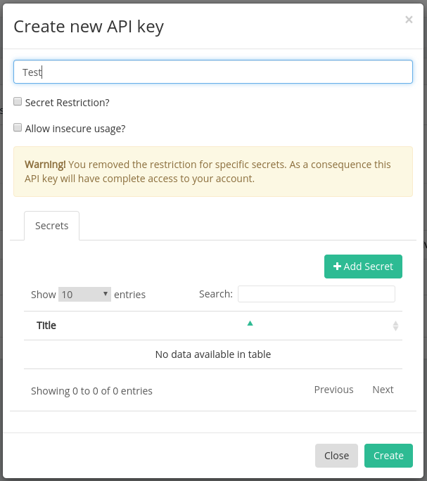
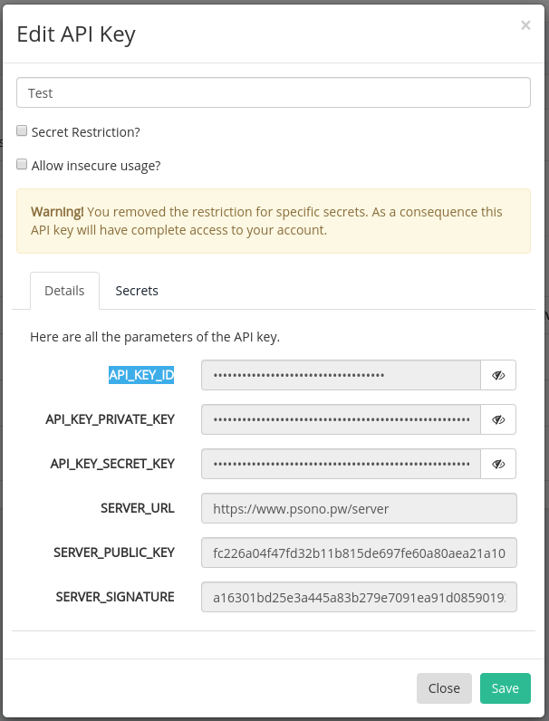

# psoco

PSONO console client

## Usage

```
psoco 0.1.0
psono command line client

USAGE:
    psoco [OPTIONS] <SUBCOMMAND>

FLAGS:
    -h, --help       Prints help information
    -V, --version    Prints version information

OPTIONS:
    -c, --config-path <config-path>    path of the psoco config.toml [env: PSOCO_CONFIG_PATH=]

SUBCOMMANDS:
    all       Get all data of a psono entry. Displays a table if there is more than one result.
    config    Show or create a psoco config
    help      Prints this message or the help of the given subcommand(s)
    list      list all entries as table
    pwd       Get passwords by id. Displays a table if there is more than one result.
    search    search all datastores
    user      Get username by id. Displays a table if there is more than one result
```

## CI/CD Usage

See [ci.sh](./examples/ci.sh) for an example script on how to use `psoco` during your CI/CD process.

## Build

### Rust native

If you have rust installed just run `cargo build --release`.

The current version builds with Rust `1.43`.

### Docker to create a static linux binary (musl)

The included `Dockerfile` can be used to build a static binary using `x86_64-unknown-linux-musl`.

Afterwards the stripped binary will be located at: `./build/psoco`.

```
$> file build/psoco
build/psoco: ELF 64-bit LSB executable, x86-64, version 1 (SYSV), statically linked, stripped
```

This way is also used to create the `psoco` releases.

## Install

Download `psoco` binary and place into a directory which is part of your `$PATH`.

## Setup / Config

### Create API Key

1. Go to `Other -> API Keys` and click `Create new API Key`.
2. Name your API key and make sure neither `Secret Restriction?` nor `Allow insecure usage?` are activated. (see Image )
3. Click Create
4. In the API key overview click on the edit Icon for the newly created key
5. In this view you will see all secrets you need for the `psoco` config (see image 2)

#### Create API Key



#### View API Key



### Create Config

Default config location:

-   Linux: `$HOME/.config/psoco/config.toml`
-   Mac: `/Users/UserName/Library/Preferences/eu.dfjk.psoco/config.toml`
-   Windows: `C:\Users\UserName\AppData\Roaming\dfjk\psoco\config.toml`

It's possible to change the default location by setting the environment variable `PSOCO_CONFIG_PATH` or using the command line option `--config-path` (`-c` for short) followed by the path.

#### Interactive Config Creation

Run `psoco config create` and fill in all your API key data (see API key creation) when asked.

#### Config Template

Alternatively `psoco config template` prints a config template which can by adjusted manually:

```
api_key_id = '00c0ffee-babe-dead-beef-dec0de000000'
api_key_private_key = '1234567890123456789012345678901234567890123456789012345678901234'
api_key_secret_key = '4321098765432109876543210987654321098765432109876543210987654321'
server_url = 'https://www.psono.pw/server'
server_signature = 'a16301bd25e3a445a83b279e7091ea91d085901933f310fdb1b137db9676de59'
danger_disable_tls = false
```

#### Config Entries

| Settings            | Type               | Description                                                                                                                            |
| ------------------- | ------------------ | -------------------------------------------------------------------------------------------------------------------------------------- |
| api_key_id          | UUID               | The UUID of your API key                                                                                                               |
| api_key_private_key | 64 byte hex string | Private key used to sign the client login info                                                                                         |
| api_key_secret_key  | 64 byte hex string | Secret key used for encryption of the user's secret key                                                                                |
| server_url          | URL                | Address of the PSONO's backend server - e.g.: https://www.psono.pw/server                                                              |
| server_signature    | 64 byte hex string | PSONO servers signature - psoco checks if the session data is signed by this public key                                                |
| danger_disable_tls  | bool               | **Danger**: disables TLS host verification. You should only set this to true if your psono instance uses an untrusted TLS certificate. |

The default PSONO instance at `https://www.psono.pw/server` will always use a trusted TLS certificate.

#### Check config

You can check your config with `psoco config show`.

This command will tell you the configs' location and if it is valid (use `show -r` for raw output).

By default only the beginning and end of the privat keys are shown and the rest replaced with `X`s. If you want to display the full private and secret keys then use `show -p`.

## License

[MIT](https://opensource.org/licenses/MIT)
